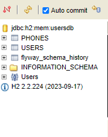

# Documentación

## Índice
1. Ejecución local
2. Notas Adicionales


## Ejecución local

El proyecto trabaja con la librería MapStruct por lo que puede ser necesario hacer un:

```cmd 
 mvn clean compile
```
Lo anterior generará los mappers necesarios para el proyecto, previo a la ejecución del mismo puede hacerlo en consola ubicandose en la carpeta del proyecto o puede hacerlo desde el menú lateral de Maven en Intellij.

Una vez hecho lo anterior puede ejecutar el proyecto desde las herramientas que ofrece su IDE o puede ejcutar la clase principal
<p align="center"></p>

El proyecto cuenta con Flyway para manejar las migraciónes por lo que el script correspondiente de base de datos que se encuentra en:
```cmd 
 resources/db/migrations
```
Se ejecutará de manera autómatica al levantar el proyecto, creando así las tablas de **USERS** y **PHONES**
 
El proyecto cuenta con una base de datos H2 en memoria por lo que al levantar y ser ejecutadas las migraciones usted podrá acceder a ellas desde su navegador ingresando a la ruta http://localhost:8082/h2-console deberá obtener el cuadro de login.<br>
Utilice las credenciales por defecto **usuario: sa y password: (en blanco)**

<p align="center"></p>

A continuación puede hacer uso de la API expuesta con el proyecto arriba. Busque la colección incluida en la raíz del pryecto

```cmd 
 SmartJob.postman_collection
```
Encontrará tres endpoints:
1. Create user.
2. Login.
3. Update user.

Utilice el endpoint [`Create User`] tal como se muestra en la siguiente imagen para la creación de un usuario:

<p align="center"></p>

Deberá obtener una respuesta similar como en la imagen. La colección de postman en este enpoint cuenta con un script que recolecta el token y el id del usuario generado.
Esto es para evitar la necesidad de estar copiando y trasladando los valores.

**Pruebe a continuación el endpoint [`Login`] a través del email y contraseña del usuario se podrá hacer login a la API, esto para autenticar y validar la operación de actualización en el endpoint [`Update user`], si intenta utilizar este enpoint sin haberse logueado obtendrá un error de Autorización.**
<p align="center"></p>


Una vez Logueado puede utilizar el endpoint [`Update User`], a través del cual se puede actualizar solo el correo electrónico y el nombre.
<p align="center"></p>

Obtendrá una respuesta donde podrá notar que las horas de creación actualización y login son diferentes dependiendo en qué momento se realizaron estás operaciones.

# Notas adicionales

El proyecto cuenta con validaciones en las solicitudes, por lo que si estas no son cubiertas puede obtener un **BAD REQUEST** cómo se muestra a continuación:
<p align="center"></p>

### El proyecto implementa una forma rudimentaria de autenticación y autorización, se recomienda implementar **OAut2** para una mayor fiabilidad en la seguridad. 
